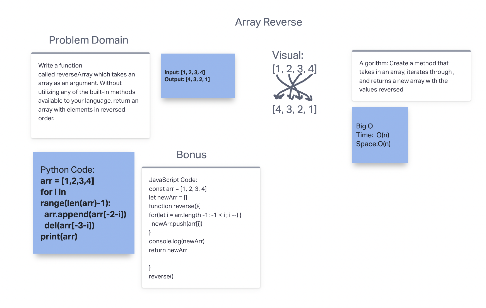

# Reverse an Array

Write a function called reverseArray which takes an array as an argument. Without utilizing any of the built-in methods available to your language, return an array with elements in reversed order.

## Whiteboard Process

## Approach & Efficiency

I took a standard for loop approach which gives me a Big(O) that is O(n) for both time and space in both languages.
